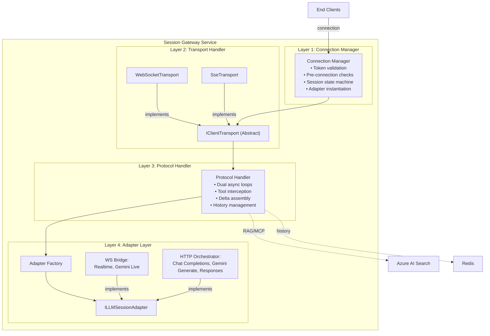

```mermaid
graph TB
    subgraph "REST API Service"
        direction TB
        
        subgraph "Layer 1: HTTP Controllers"
            AuthCtrl["Auth Controllers<br/>POST /auth/register<br/>POST /auth/login<br/>POST /auth/logout<br/>POST /auth/refresh-token<br/>POST /auth/forgot-password<br/>POST /auth/reset-password<br/>GET /auth/profile"]
            
            ProjectCtrl["Project Controllers<br/>POST /projects<br/>GET /projects<br/>GET /projects/:id<br/>PATCH /projects/:id<br/>DELETE /projects/:id"]
            
            ConfigCtrl["Config Controllers<br/>GET /projects/:id/config<br/>PATCH /projects/:id/config"]
            
            PromptCtrl["System Prompt Controllers<br/>POST /projects/:id/prompts<br/>GET /projects/:id/prompts<br/>GET /projects/:id/prompts/:id<br/>PATCH /projects/:id/prompts/:id/activate<br/>DELETE /projects/:id/prompts/:id"]
            
            KeyCtrl["API Key Controllers<br/>POST /projects/:id/keys<br/>GET /projects/:id/keys<br/>DELETE /projects/:id/keys/:id"]
            
            TokenCtrl["Ephemeral Token Controllers<br/>POST /projects/:id/tokens<br/>GET /projects/:id/tokens/audit"]
            
            RAGCtrl["RAG Controllers<br/>POST /projects/:id/documents<br/>GET /projects/:id/documents<br/>DELETE /projects/:id/documents/:id"]
            
            MCPCtrl["MCP Controllers<br/>POST /projects/:id/mcp-servers<br/>GET /projects/:id/mcp-servers<br/>POST /projects/:id/mcp-servers/:id/rediscover<br/>DELETE /projects/:id/mcp-servers/:id"]
            
            SessionCtrl["Session Controllers<br/>GET /projects/:id/sessions<br/>GET /sessions/:id<br/>DELETE /admin/sessions/:id"]
            
            UsageCtrl["Usage Controllers<br/>GET /projects/:id/usage<br/>GET /users/:id/usage"]
            
            CatalogCtrl["Catalog Controllers<br/>GET /catalog/providers<br/>GET /catalog/apis<br/>GET /catalog/models"]
            
            AdminCtrl["Admin Controllers<br/>GET /admin/users<br/>GET /admin/users/:id<br/>PATCH /admin/users/:id<br/>GET /admin/audit-logs<br/>POST /admin/plans<br/>GET /admin/plans"]
        end
        
        subgraph "Layer 2: CQRS/MediatR Handler Layer"
            AuthHandler["Auth Handlers<br/>RegisterUserCommand<br/>LoginCommand<br/>RefreshTokenCommand<br/>PasswordResetCommand"]
            
            ProjectHandler["Project Handlers<br/>CreateProjectCommand<br/>UpdateProjectCommand<br/>DeactivateProjectCommand<br/>GetProjectQuery"]
            
            ConfigHandler["Config Handlers<br/>UpdateConfigCommand<br/>GetConfigQuery"]
            
            PromptHandler["Prompt Handlers<br/>CreatePromptCommand<br/>ActivatePromptCommand<br/>ListPromptsQuery<br/>DeletePromptCommand"]
            
            KeyHandler["API Key Handlers<br/>IssueKeyCommand<br/>RevokeKeyCommand<br/>ListKeysQuery"]
            
            TokenHandler["Token Handlers<br/>IssueEphemeralTokenCommand<br/>ValidateTokenQuery"]
            
            RAGHandler["RAG Handlers<br/>UploadDocumentCommand<br/>TriggerIndexingCommand<br/>DeleteDocumentCommand<br/>ListDocumentsQuery"]
            
            MCPHandler["MCP Handlers<br/>RegisterMCPServerCommand<br/>DiscoverToolsCommand<br/>ListMCPServersQuery"]
            
            SessionHandler["Session Handlers<br/>GetActiveSessQuery<br/>GetSessionDetailQuery<br/>ForceCloseSessionCommand"]
            
            UsageHandler["Usage Handlers<br/>GetProjectUsageQuery<br/>GetUserUsageQuery<br/>AccumulateUsageCommand"]
            
            CatalogHandler["Catalog Handlers<br/>GetProvidersQuery<br/>GetAPIsQuery<br/>GetModelsQuery"]
            
            AdminHandler["Admin Handlers<br/>ManageUsersCommand<br/>ManageCatalogsCommand<br/>ManagePlansCommand"]
        end
        
        subgraph "Layer 3: Repository & Data Access"
            UserRepo["UserRepository<br/>+ Get, Create, Update<br/>+ GetByEmail, GetById<br/>+ tenant scope predicate"]
            
            ProjectRepo["ProjectRepository<br/>+ GetByUser<br/>+ GetById<br/>+ Create, Update, Delete<br/>+ user_id scope"]
            
            ConfigRepo["ConfigRepository<br/>+ GetByProject<br/>+ Update"]
            
            PromptRepo["PromptRepository<br/>+ GetByProject<br/>+ GetActive<br/>+ Create, Archive<br/>+ SetActive"]
            
            KeyRepo["KeyRepository<br/>+ GetByProjectId<br/>+ GetByHash<br/>+ Create, Revoke"]
            
            TokenRepo["TokenRepository<br/>+ Create<br/>+ UpdateOutcome<br/>+ CleanupExpired"]
            
            RAGRepo["RAGRepository<br/>+ CreateDocument<br/>+ UpdateIndexStatus<br/>+ DeleteDocument<br/>+ project_id scope"]
            
            MCPRepo["MCPRepository<br/>+ GetByProject<br/>+ Create, Update, Delete<br/>+ DiscoveredTools"]
            
            SessionRepo["SessionRepository<br/>+ CreateSession<br/>+ GetActive<br/>+ GetHistorical<br/>+ UpdateUsage"]
            
            AuditRepo["AuditRepository<br/>+ LogAction<br/>+ QueryLogs"]
            
            PlanRepo["PlanRepository<br/>+ GetAll<br/>+ Create, Update"]
        end
        
        subgraph "Layer 4: Business Logic & Validators"
            AuthLogic["Auth Logic<br/>• Password hashing<br/>• JWT signing<br/>• Refresh token rotation<br/>• Email verification"]
            
            PlanValidator["Plan Validator<br/>• Check quotas<br/>• Enforce limits<br/>• Rate limiting"]
            
            RAGLogic["RAG Logic<br/>• File upload validation<br/>• Trigger AI Search indexing<br/>• Poll/webhook for completion"]
            
            MCPLogic["MCP Logic<br/>• URL validation (HTTPS,<br/>non-RFC1918)<br/>• Discovery orchestration<br/>• Tool caching"]
            
            SecurityLogic["Security Logic<br/>• IDOR checks<br/>• Credential encryption<br/>• Scope enforcement"]
            
            UsageLogic["Usage Logic<br/>• Token cost calculation<br/>• Monthly quota tracking<br/>• Billing preparation"]
        end
    end
    
    subgraph "Persistence & Infrastructure"
        PostgreSQL["PostgreSQL<br/>• Users<br/>• Projects<br/>• Configs<br/>• Prompts<br/>• API Keys<br/>• Tokens (audit)<br/>• Documents metadata<br/>• MCP Servers<br/>• Tools<br/>• Sessions<br/>• Usage records<br/>• Audit logs<br/>• Plans"]
        
        RedisCache["Redis Cache<br/>• API key fast-path<br/>• Project config<br/>• MCP tool lists<br/>• Rate limit counters<br/>• Session metadata<br/>(mirrored from DB)"]
        
        KeyVault["Azure Key Vault<br/>• LLM provider API keys<br/>• Tool auth credentials<br/>• MCP server auth<br/>• JWT signing keys"]
        
        BlobStorage["Azure Blob Storage<br/>• RAG documents<br/>(raw uploads)"]
        
        EmailService["Email Service<br/>(SMTP / Azure Comms)<br/>• Verification emails<br/>• Password reset links<br/>• Notifications"]
        
        AzureSearch["Azure AI Search<br/>• Document vectors<br/>• Metadata filtering<br/>• Indexer management"]
    end
    
    subgraph "External Integrations"
        Auth0["Auth0 / Custom<br/>(Future OAuth)"]
        StripeAPI["Stripe API<br/>(Future Billing)"]
    end
    
    subgraph "Session Gateway Service"
        SGateway["Session Gateway<br/>(reads config,<br/>validates tokens,<br/>calls usage handlers)"]
    end
    
    %% Controller → Handler
    AuthCtrl -->|routes to| AuthHandler
    ProjectCtrl -->|routes to| ProjectHandler
    ConfigCtrl -->|routes to| ConfigHandler
    PromptCtrl -->|routes to| PromptHandler
    KeyCtrl -->|routes to| KeyHandler
    TokenCtrl -->|routes to| TokenHandler
    RAGCtrl -->|routes to| RAGHandler
    MCPCtrl -->|routes to| MCPHandler
    SessionCtrl -->|routes to| SessionHandler
    UsageCtrl -->|routes to| UsageHandler
    CatalogCtrl -->|routes to| CatalogHandler
    AdminCtrl -->|routes to| AdminHandler
    
    %% Handler → Repository
    AuthHandler -->|queries/commands| UserRepo
    ProjectHandler -->|queries/commands| ProjectRepo
    ConfigHandler -->|queries/commands| ConfigRepo
    PromptHandler -->|queries/commands| PromptRepo
    KeyHandler -->|queries/commands| KeyRepo
    TokenHandler -->|queries/commands| TokenRepo
    RAGHandler -->|queries/commands| RAGRepo
    MCPHandler -->|queries/commands| MCPRepo
    SessionHandler -->|queries/commands| SessionRepo
    UsageHandler -->|queries/commands| SessionRepo
    CatalogHandler -->|reads| PlanRepo
    AdminHandler -->|queries/commands| UserRepo
    AdminHandler -->|queries/commands| AuditRepo
    AdminHandler -->|queries/commands| PlanRepo
    
    %% Repository → Database
    UserRepo -->|CRUD| PostgreSQL
    ProjectRepo -->|CRUD| PostgreSQL
    ConfigRepo -->|CRUD| PostgreSQL
    PromptRepo -->|CRUD| PostgreSQL
    KeyRepo -->|CRUD| PostgreSQL
    TokenRepo -->|CRUD| PostgreSQL
    RAGRepo -->|CRUD| PostgreSQL
    MCPRepo -->|CRUD| PostgreSQL
    SessionRepo -->|CRUD| PostgreSQL
    AuditRepo -->|CRUD| PostgreSQL
    PlanRepo -->|CRUD| PostgreSQL
    
    %% Logic → Infrastructure
    AuthLogic -->|retrieves/stores| KeyVault
    PlanValidator -->|reads| RedisCache
    RAGLogic -->|uploads| BlobStorage
    RAGLogic -->|triggers| AzureSearch
    MCPLogic -->|caches| RedisCache
    SecurityLogic -->|retrieves| KeyVault
    UsageLogic -->|caches| RedisCache
    
    %% Business Logic attached to Handlers
    AuthHandler -.->|uses| AuthLogic
    PlanValidator -.->|used by| KeyHandler
    PlanValidator -.->|used by| TokenHandler
    PlanValidator -.->|used by| RAGHandler
    RAGHandler -.->|uses| RAGLogic
    MCPHandler -.->|uses| MCPLogic
    SecurityLogic -.->|enforced by| KeyHandler
    UsageLogic -.->|used by| UsageHandler
    
    %% Infrastructure Connections
    KeyVault -->|provides secrets| KeyVault
    RedisCache -->|fast lookup| RedisCache
    BlobStorage -->|raw files| BlobStorage
    EmailService -->|sends| AuthLogic
    
    %% Session Gateway Integration
    SGateway -->|reads config| PostgreSQL
    SGateway -->|validates tokens| RedisCache
    SGateway -->|logs usage| UsageHandler
    
    %% Styling
    style "REST API Service" fill:#f5f5f5,stroke:#333,stroke-width:2px
    style "Persistence & Infrastructure" fill:#e8f4f8,stroke:#3498db,stroke-width:2px
    style "External Integrations" fill:#ffe6e6,stroke:#e74c3c,stroke-width:2px
    style PostgreSQL fill:#d4e6f1,stroke:#3498db,stroke-width:2px
    style RedisCache fill:#d4e6f1,stroke:#3498db,stroke-width:2px
    style KeyVault fill:#d4e6f1,stroke:#3498db,stroke-width:2px
    style BlobStorage fill:#d4e6f1,stroke:#3498db,stroke-width:2px
    style AzureSearch fill:#d4e6f1,stroke:#3498db,stroke-width:2px
```